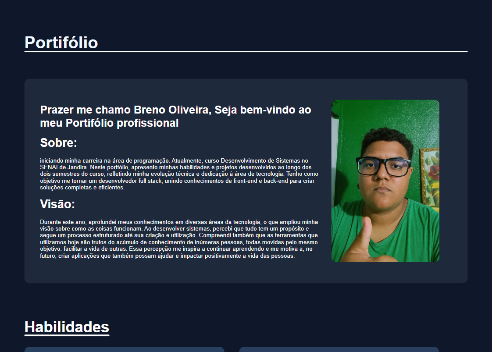

# Portfólio

## Sobre o Projeto
Este projeto foi desenvolvido como parte da disciplina de **Projeto de Software**, com o objetivo de aplicar na prática os conhecimentos adquiridos em sala.  
Durante o processo, foram realizados os seguintes passos:
- Elaboração do **TAP** (Termo de Abertura do Projeto);  
- Criação e organização do projeto no **GitHub** utilizando a metodologia **Kanban**;  
- Criação de **issues**;
- Definição de **milestones**;  
- Realização do **deploy** da aplicação.

## Descrição
O objetivo deste projeto é desenvolver um **portfólio profissional** para divulgação no **LinkedIn**, com o propósito de **apresentar habilidades, experiências e projetos**, aumentando a visibilidade para oportunidades profissionais.  

A estrutura da página é composta por:
1. **Header** – Título;  
2. **Apresentação** – Breve introdução pessoal e profissional;  
3. **Habilidades** – Tecnologias e competências dominadas;  
4. **Projetos de Destaque** – Trabalhos e sistemas desenvolvidos;  
5. **Formação / Experiência Profissional** – Histórico acadêmico e profissional;  
6. **Footer** – Meios de contato e redes sociais.

## Imagem da Aplicação

## Tecnologias Utilizadas
- **HTML5**  
- **CSS3**

## Autor
**[Breno Oliveira Assis Reis](https://www.linkedin.com/in/breno-oliveira-assis-reis-203010351/)**
